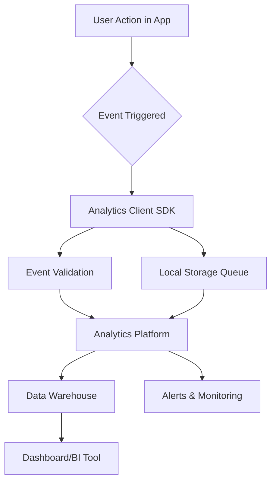

# Analytics Implementation Plan

**Team:** [Your Team Name]  
**Date:** [Date]  
**Product:** [Your Product Name]  
**Timeline:** [e.g., Weeks 6-8]

---

## Executive Summary

**Purpose of this document:**  
This plan outlines HOW we'll implement analytics for our product, including technical architecture, tooling, timeline, and team responsibilities.

**Key Decisions:**
- **Analytics Platform:** [e.g., Segment, Mixpanel, Custom solution]
- **Implementation Approach:** [e.g., Frontend + Backend tracking]
- **Timeline:** [e.g., 3 weeks from Week 6 to Week 8]
- **Success Criteria:** [e.g., All core events firing by Week 8]

---

## Goals & Success Criteria

### What We're Trying to Achieve

**Primary Goals:**
1. **Track North Star Metric:** Ability to measure [your NSM] accurately
2. **Monitor AARRR Funnel:** Track all 5 stages (Acquisition → Revenue)
3. **Enable Data-Driven Decisions:** Dashboard for weekly team review
4. **Ensure Data Quality:** 95%+ event delivery success rate

**Success Criteria for Analytics Implementation:**

| Criterion | Target | How We'll Measure |
|-----------|--------|-------------------|
| Event Coverage | 6-10 core events instrumented | Count of implemented events |
| Data Accuracy | <5% event loss rate | Compare sent vs received events |
| Dashboard Availability | Real-time (< 1 min delay) | Test event → dashboard latency |
| Team Adoption | 100% team using dashboard weekly | Dashboard view tracking |
| Performance Impact | < 50ms added latency | Performance monitoring |

---

## Analytics Architecture

### High-Level Design

**Components:**



**Description:**  
[Briefly describe how data flows from user action to dashboard]

**Example:**
"When a user completes a study session, our frontend triggers `study_session_completed` event. The analytics SDK validates the event schema, queues it locally, and sends it asynchronously to Segment. Segment forwards to our data warehouse (BigQuery) where it's processed and displayed in our Grafana dashboard within 60 seconds."

---

### Technology Stack

| Component | Tool/Service | Version | Justification |
|-----------|-------------|---------|---------------|
| **Analytics Platform** | [e.g., Segment, Mixpanel, Amplitude] | [Version] | [Why this tool?] |
| **Data Warehouse** | [e.g., BigQuery, PostgreSQL, MongoDB] | [Version] | [Why this tool?] |
| **Visualization** | [e.g., Grafana, Metabase, Amplitude] | [Version] | [Why this tool?] |
| **Client SDK** | [e.g., analytics.js, Native SDKs] | [Version] | [Why this tool?] |
| **Backend Tracking** | [e.g., Node.js library, Python SDK] | [Version] | [Why this tool?] |

**Example:**
- **Analytics Platform:** Segment (Free tier) - Industry standard, easy integration, supports multiple destinations
- **Data Warehouse:** PostgreSQL 15.3 - We already use it, no additional cost
- **Visualization:** Grafana (Open source) - Free, flexible, team knows it from other projects
- **Client SDK:** Segment analytics.js 2.0 - Works with our React app
- **Backend Tracking:** Segment Node.js SDK 2.0 - Consistent with frontend

---

### Alternative Solutions Considered

| Solution | Pros | Cons | Why Not Chosen |
|----------|------|------|----------------|
| [Option 1] | [Pros] | [Cons] | [Reasoning] |
| [Option 2] | [Pros] | [Cons] | [Reasoning] |

**Example:**
- **Google Analytics:** Free, familiar → Too limited for custom events, doesn't support our event schema
- **Mixpanel:** Great UI, built for products → $25/mo after trial, over budget for MVP
- **Custom solution:** Full control, free → Too time-consuming to build, not core to MVP

---

## Implementation Timeline

### Week-by-Week Plan

**Week 6: Foundation**
- [ ] Set up analytics platform account
- [ ] Configure development/staging/production environments
- [ ] Install client SDK in frontend
- [ ] Install server SDK in backend
- [ ] Implement first 2 events (signup_started, signup_completed)
- [ ] Verify events appearing in platform

**Week 7: Core Events**
- [ ] Implement remaining 4-6 core events
- [ ] Add event validation and error handling
- [ ] Set up data warehouse connection
- [ ] Build basic dashboard showing NSM
- [ ] Test all events in staging environment

**Week 8: Polish & Launch**
- [ ] Deploy to production
- [ ] Monitor event volume and accuracy for 3 days
- [ ] Build complete AARRR funnel dashboard
- [ ] Train team on dashboard usage
- [ ] Document analytics for future team members

---

### Daily Breakdown (Example for Week 6)

| Day | Tasks | Owner | Estimated Hours |
|-----|-------|-------|-----------------|
| Monday | Research and select analytics platform | [Name] | 2 |
| Monday | Set up accounts and get API keys | [Name] | 1 |
| Tuesday | Install frontend SDK | [Name] | 2 |
| Tuesday | Install backend SDK | [Name] | 2 |
| Wednesday | Implement signup events | [Name] | 3 |
| Thursday | Test events in dev environment | [Name] | 2 |
| Friday | Deploy to staging and verify | [Team] | 2 |

---

## Technical Implementation

### Frontend (Web/Mobile)

**Framework:** [e.g., React, React Native, Flutter]

**Installation Steps:**
```bash
# Example for Segment
npm install @segment/analytics-next
```

**Configuration:**
```javascript
// Example analytics initialization
import { AnalyticsBrowser } from '@segment/analytics-next'

export const analytics = AnalyticsBrowser.load({
  writeKey: process.env.REACT_APP_SEGMENT_WRITE_KEY
})

// Wrapper function for consistent tracking
export function trackEvent(eventName, properties = {}) {
  const standardProps = {
    timestamp: new Date().toISOString(),
    platform: 'web',
    app_version: process.env.REACT_APP_VERSION,
    environment: process.env.NODE_ENV
  };
  
  analytics.track(eventName, {
    ...standardProps,
    ...properties
  });
}
```

**Usage Example:**
```javascript
// In your React component
import { trackEvent } from './analytics';

function SignupButton() {
  const handleClick = () => {
    trackEvent('user_signup_started', {
      signup_method: 'google',
      referral_source: 'instagram'
    });
    // ... rest of signup logic
  };
  
  return <button onClick={handleClick}>Sign Up</button>;
}
```

---

### Backend (API/Server)

**Framework:** [e.g., Node.js/Express, Python/Flask, Ruby/Rails]

**Installation Steps:**
```bash
# Example for Node.js + Segment
npm install @segment/analytics-node
```

**Configuration:**
```javascript
// Example backend analytics setup
const Analytics = require('@segment/analytics-node');

const analytics = new Analytics({
  writeKey: process.env.SEGMENT_WRITE_KEY,
  flushAt: 20,      // Flush every 20 events
  flushInterval: 10000  // Or every 10 seconds
});

function trackEvent(userId, eventName, properties = {}) {
  analytics.track({
    userId: userId,
    event: eventName,
    properties: {
      timestamp: new Date().toISOString(),
      platform: 'api',
      app_version: process.env.APP_VERSION,
      environment: process.env.NODE_ENV,
      ...properties
    }
  });
}

module.exports = { trackEvent };
```

**Usage Example:**
```javascript
// In your API endpoint
app.post('/api/sessions', async (req, res) => {
  const session = await createSession(req.body);
  
  trackEvent(req.user.id, 'study_session_created', {
    session_id: session.id,
    session_type: session.type,
    subject: session.subject
  });
  
  res.json(session);
});
```

---

### Environment Configuration

**Development:**
```env
# .env.development
REACT_APP_SEGMENT_WRITE_KEY=dev_write_key_xyz123
SEGMENT_WRITE_KEY=dev_write_key_xyz123
ANALYTICS_ENABLED=true
ANALYTICS_DEBUG=true
```

**Staging:**
```env
# .env.staging
REACT_APP_SEGMENT_WRITE_KEY=staging_write_key_abc456
SEGMENT_WRITE_KEY=staging_write_key_abc456
ANALYTICS_ENABLED=true
ANALYTICS_DEBUG=false
```

**Production:**
```env
# .env.production
REACT_APP_SEGMENT_WRITE_KEY=prod_write_key_def789
SEGMENT_WRITE_KEY=prod_write_key_def789
ANALYTICS_ENABLED=true
ANALYTICS_DEBUG=false
```

---

## Event Implementation Checklist

For each event in your event schema:

### Event: [Event Name]

- [ ] **Defined:** Event documented in event-schema.md
- [ ] **Instrumented:** Code written to fire event
- [ ] **Tested (Dev):** Event fires correctly in development
- [ ] **Tested (Staging):** Event fires correctly in staging
- [ ] **Validated:** All required properties present
- [ ] **No PII:** Verified no personally identifiable information
- [ ] **Dashboard:** Event appears in dashboard
- [ ] **Deployed:** Live in production

**Location:** [File path where event is triggered]  
**Owner:** [Team member responsible]  
**Status:** [Not Started / In Progress / Complete]

---

Repeat for all 6-10 core events.

---

## Dashboard Design

### North Star Metric Dashboard

**Primary View:**

**Metrics to Display:**
1. **Current NSM Value:** [e.g., 142 weekly active sessions]
2. **Week-over-Week Change:** [e.g., +12% from last week]
3. **Trend Line:** 30-day rolling average
4. **Breakdown by Segment:** [e.g., By user cohort, by feature usage]

**Refresh Rate:** Real-time (< 1 minute delay)

**Access:** All team members

**Example Mockup:**
```
╔════════════════════════════════════════════════╗
║  North Star Metric: Weekly Active Sessions    ║
║                                                ║
║  Current: 142                  ▲ +12% vs LW   ║
║                                                ║
║  [Line graph showing 30-day trend]            ║
║                                                ║
║  Breakdown:                                    ║
║  - Week 1 Cohort: 45 sessions                ║
║  - Week 2 Cohort: 62 sessions                ║
║  - Week 3 Cohort: 35 sessions                ║
╚════════════════════════════════════════════════╝
```

---

### AARRR Funnel Dashboard

**View:** Funnel visualization

**Stages:**
1. **Acquisition:** Signup started → Signup completed
2. **Activation:** Signup completed → First [core action] within 48h
3. **Retention:** Activated users → Still active on Day 7
4. **Referral:** Active users → Sent invite
5. **Revenue:** (If applicable) Active users → Paid

**Conversion Rates:**
- Acquisition: [Target %]
- Activation: [Target %]
- Retention: [Target %]
- Referral: [Target %]
- Revenue: [Target %]

**Alerts:**
- If any stage drops below [X%], send Slack alert to team

---

### Weekly Review Dashboard

**Purpose:** Team looks at this every Monday

**Sections:**
1. **North Star Metric:** Current value, trend, WoW change
2. **AARRR Funnel:** All stages with conversion rates
3. **Top Features:** Most used features this week
4. **Drop-off Points:** Where users are leaving
5. **Cohort Analysis:** How different user groups are performing

---

## Data Quality & Monitoring

### Validation Rules

**Pre-send validation (in code):**
- Required properties present
- Data types match schema
- Enum values are valid
- String lengths within limits
- No PII accidentally included

**Example validation function:**
```javascript
function validateEvent(eventName, properties) {
  const schema = EVENT_SCHEMAS[eventName];
  
  // Check required properties
  for (const prop of schema.required) {
    if (!(prop in properties)) {
      throw new Error(`Missing required property: ${prop}`);
    }
  }
  
  // Check data types
  for (const [key, value] of Object.entries(properties)) {
    const expectedType = schema.properties[key].type;
    if (typeof value !== expectedType) {
      throw new Error(`Invalid type for ${key}: expected ${expectedType}`);
    }
  }
  
  return true;
}
```

---

### Error Handling

**Client-side errors:**
- Log to console in development
- Send to error monitoring (Sentry) in production
- Queue failed events for retry
- Don't block user experience

**Server-side errors:**
- Log to application logs
- Alert on-call engineer if > 10% failure rate
- Retry with exponential backoff
- Store failed events for manual reprocessing

---

### Monitoring & Alerts

**Daily Checks:**
- [ ] Event volume within expected range (± 20%)
- [ ] No events with 100% failure rate
- [ ] Dashboard loading within 3 seconds
- [ ] Data freshness < 5 minutes

**Alerts to Set Up:**

| Condition | Alert Channel | Recipient |
|-----------|--------------|-----------|
| Event failure rate > 10% | Slack | Tech Lead |
| Zero events for 1 hour | Email + Slack | Entire team |
| NSM drops 20% WoW | Slack | Product Lead |
| Dashboard down > 5 min | SMS | Tech Lead |

---

## Testing Strategy

### Unit Tests

**What to test:**
- Event tracking functions
- Property validation
- Error handling
- Retry logic

**Example test:**
```javascript
describe('trackEvent', () => {
  it('should include all required properties', () => {
    const event = trackEvent('user_signup_started', {
      signup_method: 'google'
    });
    
    expect(event).toHaveProperty('event_id');
    expect(event).toHaveProperty('user_id');
    expect(event).toHaveProperty('timestamp');
    expect(event.signup_method).toBe('google');
  });
  
  it('should throw error for missing required property', () => {
    expect(() => {
      trackEvent('user_signup_started', {});
    }).toThrow('Missing required property: signup_method');
  });
});
```

---

### Integration Tests

**What to test:**
- Events fire on user actions
- Events reach analytics platform
- Events appear in dashboard

**Testing approach:**
1. Automated tests in CI/CD for critical paths
2. Manual QA checklist for full user flows
3. Staging environment mirrors production setup

---

### End-to-End Testing

**User Flow Test Example:**

**Scenario:** New user signs up and completes first session

**Steps:**
1. Navigate to signup page
2. Click "Sign up with Google"
3. Complete signup form
4. Verify `user_signup_started` fired
5. Verify `user_signup_completed` fired
6. Create first study session
7. Complete session
8. Verify `study_session_completed` fired
9. Check dashboard for all events
10. Verify NSM updated correctly

**Expected Results:**
- All events present in analytics platform within 60 seconds
- Properties match expected schema
- NSM increments by 1
- No errors in browser console

---

## Team Responsibilities

### Analytics Owner: [Name]

**Responsibilities:**
- Overall analytics strategy
- Review weekly metrics with team
- Approve new events before implementation
- Maintain this documentation

**Time commitment:** 3-4 hours/week

---

### Tech Lead: [Name]

**Responsibilities:**
- Technical implementation decisions
- Code review for analytics instrumentation
- Set up dashboards and alerts
- Troubleshoot data quality issues

**Time commitment:** 5-6 hours/week during implementation (Weeks 6-8)

---

### All Developers

**Responsibilities:**
- Implement events in assigned features
- Write tests for analytics code
- Follow event schema strictly
- Report bugs or missing events

**Time commitment:** 1-2 hours/week

---

## Privacy & Compliance

### Data Collection Notice

**Where:** Privacy policy, signup flow

**Language:**
"We collect usage data to improve your experience. This includes actions you take in the app, features you use, and how long you spend. We DO NOT collect your messages, notes, or personal content. You can opt out in Settings."

---

### User Consent

**Approach:** [e.g., Opt-in, Opt-out, Implicit consent]

**Implementation:**
- [ ] Consent checkbox on signup (if opt-in)
- [ ] Settings page to disable tracking
- [ ] Respect Do Not Track header (optional)

---

### Data Security

**In Transit:**
- All events sent over HTTPS
- API keys stored in environment variables
- Rotate keys every 90 days

**At Rest:**
- Data warehouse encrypted
- Access limited to team members
- Backups encrypted

---

## Budget & Costs

### Free Tier Limits

**Analytics Platform:**
- [Service name]: [Limits, e.g., "10,000 events/month free"]
- Expected usage: [Your estimate]
- Headroom: [% of free tier]

**Data Warehouse:**
- [Service name]: [Limits]
- Expected usage: [Your estimate]

**Visualization:**
- [Service name]: [Limits]
- Expected usage: [Your estimate]

---

### Upgrade Triggers

**When we'll need to upgrade:**
- If event volume exceeds [X] per month
- If team grows beyond [Y] members
- If we need [specific feature] not in free tier

**Estimated cost:** $[amount]/month

**Budget approval:** Required from [instructor/advisor] before upgrading

---

## Launch Checklist

**Pre-Launch (Week 8):**
- [ ] All 6-10 core events implemented
- [ ] Events tested in staging environment
- [ ] Dashboard built and accessible to team
- [ ] Alerts configured
- [ ] Team trained on dashboard usage
- [ ] Documentation complete
- [ ] Privacy policy updated
- [ ] Monitoring in place

**Launch Day:**
- [ ] Deploy analytics code to production
- [ ] Verify first events appearing in dashboard
- [ ] Monitor for 24 hours
- [ ] Fix any issues immediately

**Post-Launch (First Week):**
- [ ] Daily check on event volume
- [ ] Validate data accuracy against expectations
- [ ] Gather team feedback on dashboard
- [ ] Document any bugs or issues
- [ ] Create backlog of improvements

---

## Maintenance Plan

### Weekly Tasks

**Every Monday Morning (30 minutes):**
- [ ] Review NSM and WoW change
- [ ] Check AARRR funnel conversion rates
- [ ] Identify any drop-off points
- [ ] Discuss insights in team standup

---

### Monthly Tasks

**First Monday of Each Month (1 hour):**
- [ ] Review event schema for needed updates
- [ ] Check data quality (event loss rate)
- [ ] Audit for PII accidentally sent
- [ ] Update dashboard based on feedback
- [ ] Review analytics costs vs budget

---

### As-Needed Tasks

**When to update analytics:**
- New feature launches → Add new events
- User behavior changes → Update dashboard
- Event schema issues → Fix and redeploy
- Dashboard feedback → Iterate on visualizations

---

## Success Metrics (for Analytics Itself)

**How we'll know our analytics implementation is successful:**

| Metric | Target | Current | Notes |
|--------|--------|---------|-------|
| Event Coverage | 100% of core user flows | [%] | [Notes] |
| Data Accuracy | <5% event loss | [%] | [Notes] |
| Dashboard Usage | Team views 5+ times/week | [#] | [Notes] |
| Time to Insight | <5 min from question to answer | [min] | [Notes] |
| Data-Driven Decisions | 80% of product decisions cite data | [%] | [Notes] |

---

## Risks & Mitigation

### Risk 1: Events Not Firing

**Likelihood:** Medium  
**Impact:** High (can't measure NSM)

**Mitigation:**
- Comprehensive testing in staging
- Real-time monitoring with alerts
- Fallback to manual tracking if needed

---

### Risk 2: Data Quality Issues

**Likelihood:** Medium  
**Impact:** Medium (bad data → bad decisions)

**Mitigation:**
- Schema validation before sending
- Regular audits of event properties
- Automated tests for critical events

---

### Risk 3: Performance Impact

**Likelihood:** Low  
**Impact:** Medium (slow app = bad UX)

**Mitigation:**
- Asynchronous event sending
- Batching and queueing
- Performance monitoring
- Disable analytics if latency > 100ms

---

### Risk 4: Team Doesn't Use Dashboard

**Likelihood:** Medium  
**Impact:** High (analytics is wasted effort)

**Mitigation:**
- Make dashboard dead simple
- Mandatory Monday review in standup
- Celebrate wins shown by data
- Continuously improve based on feedback

---

## Future Improvements (Post-MVP)

**Week 9+:**
1. **Cohort Analysis:** Track behavior by user cohort
2. **Funnel Analysis:** Detailed drop-off analysis
3. **A/B Testing Framework:** Built-in experimentation
4. **Predictive Analytics:** ML models for churn prediction
5. **Custom Alerts:** Automated Slack notifications for key metrics
6. **Mobile Analytics:** Native SDK for mobile apps

---

## Documentation & Training

### For New Team Members

**Onboarding Checklist:**
- [ ] Read this analytics plan
- [ ] Read event schema documentation
- [ ] Get access to analytics platform
- [ ] Get access to dashboard
- [ ] Shadow weekly metrics review
- [ ] Implement first event (with code review)

**Estimated time:** 2-3 hours

---

### For Stakeholders

**Monthly Report:**
- NSM trend and insights
- AARRR funnel performance
- Top wins and learnings
- Upcoming experiments

**Format:** 1-page PDF or Slack message

---

## References

**Internal Docs:**
- Event Schema: `/02-analytics/event-schema.md`
- North Star Metric: `/02-analytics/north-star-metric.md`
- Problem Statement: `/01-discovery/synthesis/final-problem-statement.md`

**External Resources:**
- Week 5 Lecture: AARRR & Event Instrumentation
- [Segment Documentation](https://segment.com/docs/)
- [Amplitude Analytics Guide](https://amplitude.com/blog)

---

## Team Sign-off

**All team members have reviewed this analytics plan:**

- [Name 1] - Role - Date
- [Name 2] - Role - Date
- [Name 3] - Role - Date
- [Name 4] - Role - Date
- [Name 5] - Role - Date (if applicable)

**Tech Lead approval:**  
[Name] - Date

---

## Change Log

| Date | Version | Changes | Author |
|------|---------|---------|--------|
| [Date] | 1.0 | Initial analytics plan for MVP | [Name] |

---

**Remember: Analytics is not a one-time project. It's an ongoing practice. Start simple, measure what matters, and iterate based on learnings.**
