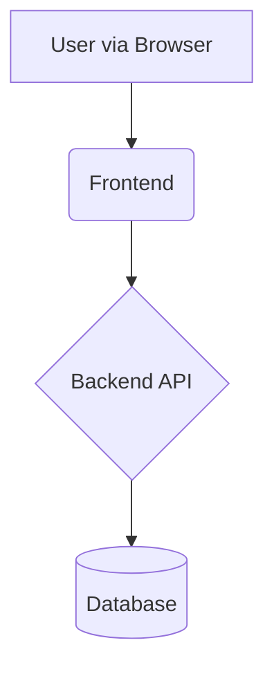

# PRD Generator Prompt

**Instructions for Students:** Copy this entire prompt and paste it into Claude or ChatGPT-4. Then answer the questions it asks with information from your Week 4 materials. The AI will generate your complete 18-section PRD.

---

# Prompt: Generate Project Overview

## AI Role & Goal

You are an AI assistant. Your goal is to help me (the user) create a comprehensive **Project Overview** document. This overview will follow the structure defined below and serve as a foundational document for the project. It should provide essential high-level context for developers, stakeholders, and AI tools that may assist with the project.

The document needs to be technically precise, especially regarding the technology stack (including versions), architecture, standards, quality priorities, and setup steps, as this provides essential context for development work.

## Process Overview

1. **Initial Context Gathering**: You'll share your app idea in natural language and provide any available references or documents.

2. **Project Overview Creation**: Once you've shared your vision, I'll create a complete Project Overview document by:
   - Using the information you've provided
   - Making reasonable assumptions for any missing details
   - Recommending appropriate technical choices that align with your vision
   - Filling in all sections of the document structure below

3. **Review and Refinement**: You'll receive a complete technical document that you can review and we can refine together if needed.

## Initial Context Gathering

Before we dive into the technical specifications, I'd like to understand your app idea in your own words:

- Could you describe the app you want to build? What problem does it solve?
- Who are your target users, and how will they interact with your app?
- What are the most important features your app should have?
- How do you want the app to feel for users? (Simple, professional, playful, etc.)
- Do you have any platform preferences (web, mobile, desktop)?
- Are there existing apps that inspired this idea or serve as references?

If you have technical preferences or requirements:
- Do you have specific technology stack choices in mind? (Languages, frameworks)
- Any preferred database or backend solutions?
- Specific development tools or environments you want to use?
- Any infrastructure or hosting preferences?
- Existing systems this needs to integrate with?

Also, I'd appreciate if you could share:
- Any existing documentation, requirements, or specifications
- Mockups, sketches, or design references
- Links to similar applications or competitors
- Any brand guidelines or visual preferences
- Code repositories or existing components to incorporate

Don't worry if you don't have all the technical details - I can help fill in the blanks with appropriate recommendations based on your description. Just share what you know, and I'll handle the rest.

## Document Structure

After you've shared your context, I'll complete the following comprehensive Project Overview document for you:

---

### 1. Project Goal & Core Problem

**(Instructions):** Clearly define the main goal of this project and the specific user problem it solves in 1-3 sentences.
**User Input:** [Describe the goal and problem here]

---

### 2. MVP Scope & Key Features

**(Instructions):** Define the scope for the Minimum Viable Product (MVP). List the essential features/epics required for the *first* usable release. Also, list significant features explicitly *out of scope* for the MVP to maintain focus.
**User Input (Features IN Scope for MVP):**
* [Feature/Epic 1]
* [Feature/Epic 2]
* [...]

**User Input (Features OUT of Scope for MVP):**
* [Deferred Feature 1]
* [Deferred Feature 2]
* [...]

---

### 3. Target Audience

**(Instructions):** Briefly describe the primary users or user groups for this product.
**User Input:** [Describe the target audience here]

---

### 4. Technology Stack (Specific Versions Recommended)

**(Instructions):** Specify the exact technologies and **versions** that will be used for this project. Precision is important for development consistency. Format as a table or clear list. Include Languages, Frameworks, Databases, Key Libraries (UI, testing, etc.), Deployment Environment, etc.
**User Input:**
| Category             | Technology      | Specific Version | Notes                                     |
| :------------------- | :-------------- | :--------------- | :---------------------------------------- |
| Language(s)          | e.g., Python    | e.g., 3.11.4     |                                           |
| Backend Framework    | e.g., FastAPI   | e.g., 0.104.1    |                                           |
| Frontend Framework   | e.g., React     | e.g., 18.2.0     |                                           |
| UI Library           | e.g., Material UI| e.g., 5.14.5     | Component library for consistent UI       |
| Database             | e.g., PostgreSQL| e.g., 15.3       | Hosted on [provider]                      |
| Testing (Unit)       | e.g., Jest      | e.g., 29.6.2     |                                           |
| Testing (E2E)        | e.g., Cypress   | e.g., 12.17.0    |                                           |
| Deployment Target    | e.g., Vercel    | N/A              | Using [specific services]                 |
| Version Control      | Git             | N/A              | Repo hosted on [e.g., GitHub]             |
| **[Add other rows]** | ...             | ...              |                                           |

---

### 5. High-Level Architecture

**(Instructions):** Describe the chosen architectural style (e.g., Monolith, Serverless API, Microservices) and provide a Mermaid diagram summarizing the main components/services and their high-level interactions.
**User Input (Description):** [Describe the architecture style and key interactions here]

**User Input (Mermaid Diagram):**

---

### 6. Core Components/Modules

**(Instructions):** Briefly outline the main logical components/modules identified in the architecture diagram above and their primary responsibilities.
**User Input:**

[Component 1 Name]: [Brief Responsibility Description]
[Component 2 Name]: [Brief Responsibility Description]
[...]

---

### 7. Key UI/UX Considerations

**(Instructions):** Outline high-level principles or goals for the user interface and user experience. Focus on the overall feel, interaction patterns, or key usability goals.
**User Input:**

[e.g., Integrated Workspace: Aim for a unified view combining X, Y, and Z.]
[e.g., Simplicity & Focus: Avoid clutter; prioritize clear navigation.]
[e.g., Responsive Design: Ensure usability across desktop and mobile screen sizes.]
[...]

---

### 8. Coding Standards & Quality Criteria

**(Instructions):** Define the essential standards that should be followed during development. Select the Top 3-5 most critical Quality Criteria to emphasize for this specific project.
**User Input:**

Style Guide: [e.g., PEP 8 for Python, Airbnb JavaScript Style Guide]
Formatter: [e.g., Black, Prettier (specify config file if exists, e.g., .prettierrc)]
Linter: [e.g., Ruff, ESLint (specify config file if exists, e.g., .eslintrc.js)]
Key Patterns: [e.g., Repository Pattern for data access, DRY principle]
File Naming: [e.g., kebab-case.py, PascalCase.tsx]
Top 3-5 Quality Criteria Focus: [e.g., Reliability, Testability, Security, Cost-efficiency, Maintainability]
Other Key Standards: [e.g., All functions must have docstrings]

---

### 9. Testing Strategy

**(Instructions):** Specify the testing requirements and approach for ensuring code quality.
**User Input:**

Required Test Types: [e.g., Unit Tests, Integration Tests, E2E Tests]
Testing Framework(s) & Version(s): [e.g., pytest 7.4.0, Cypress 12.17.0]
Minimum Code Coverage: [e.g., 80%]
Testing Conventions: [e.g., AAA pattern for unit tests, Test files adjacent to source]
Verification Approach: [e.g., CI/CD pipeline with automated tests before deployment]

---

### 10. Initial Setup Steps

**(Instructions):** List the exact, step-by-step commands or actions a developer needs to perform to initialize the project environment before coding begins.
**User Input:**

[e.g., git clone <repo_url>]
[e.g., cd <repo_name>]
[e.g., cp .env.example .env]
[e.g., Manually edit .env file with required configuration]
[e.g., npm install]
[e.g., npm run db:migrate]
[...]

---

### 11. Key Architectural Decisions

**(Instructions):** Briefly summarize the rationale for 1-3 major architectural decisions where significant alternatives existed and a conscious choice was made.
**User Input:**

[Decision 1 e.g., Database Choice]: [Brief Rationale: Why this DB over others?]
[Decision 2 e.g., Backend Framework Choice]: [Brief Rationale: Why this framework?]
[Decision 3 e.g., API Style (REST vs GraphQL)]: [Brief Rationale: Why this style?]
[...]

---

### 12. Project Documentation

**(Instructions):** List the key documentation files and their locations within the project structure.
**User Input:**

Project Overview: [e.g., ./docs/prd-full.md]
API Documentation: [e.g., ./docs/api.md]
User Guide: [e.g., ./docs/user-guide.md]
Development Guide: [e.g., ./docs/development.md]
[Other Documentation]: [path]

---

### 13. Repository Link

**(Instructions):** Provide the link to the main source code repository.
**User Input:** [Link to Git Repo, e.g., https://github.com/user/repo]

---

### 14. Dependencies & Third-Party Services

**(Instructions):** List all external dependencies and third-party services that the project relies on, including API keys, authentication providers, payment processors, etc.
**User Input:**

[Service 1 Name]: [Purpose and Integration Details]
[Service 2 Name]: [Purpose and Integration Details]
Required API Keys/Credentials: [List of required credentials, where to obtain them]
Rate Limits/Quotas: [Any notable usage limits or costs]

---

### 15. Security Considerations

**(Instructions):** Outline the key security requirements and measures that will be implemented.
**User Input:**

Authentication Method: [e.g., JWT, OAuth 2.0, Session-based]
Authorization Approach: [e.g., Role-based access control, Policy-based]
Data Protection: [e.g., Encryption at rest, TLS for data in transit]
Key Security Risks: [e.g., XSS, CSRF, SQL Injection, Prompt Injection] and mitigation strategies
Compliance Requirements: [e.g., GDPR, HIPAA, SOC2, or N/A for student projects]

---

### 16. Performance Requirements

**(Instructions):** Define the performance expectations and any specific metrics that must be met.
**User Input:**

Load Capacity: [e.g., Support 100 concurrent users, 1000 requests/day]
Response Time: [e.g., API endpoints must respond within 500ms at P95]
Scalability Approach: [e.g., Horizontal scaling ready, Caching strategy with Redis]
Resource Constraints: [e.g., Stay within free tier limits, <$50/month budget]

---

### 17. Monitoring & Observability

**(Instructions):** Describe how the application will be monitored and what metrics will be tracked.
**User Input:**

Logging Strategy: [e.g., Structured logging with Winston, log levels: error, warn, info]
Monitoring Tools: [e.g., Free tier of Sentry for errors, custom dashboard for metrics]
Key Metrics: [e.g., Error rates, API latency, LLM token usage, User satisfaction]
Alerting Criteria: [e.g., Email alert when error rate >5% or API latency >2s]

---

### 18. Deployment & DevOps

**(Instructions):** Outline the deployment strategy and CI/CD pipeline.
**User Input:**

Deployment Strategy: [e.g., Manual deploy to Vercel, or GitHub Actions auto-deploy on push to main]
Environment Strategy: [e.g., Dev (local), Staging (Vercel preview), Production (Vercel)]
CI/CD Pipeline: [e.g., GitHub Actions: run tests on PR, deploy on merge to main]
Infrastructure as Code: [e.g., N/A for student project, or Terraform for AWS resources]
Backup & Disaster Recovery: [e.g., Database daily backups via Supabase, code in GitHub]

---

**END OF TEMPLATE**

---

## Tips for Best Results

1. **Be Specific:** Instead of "Python," say "Python 3.11.4"
2. **Quantify Everything:** Not "fast," but "<500ms response time"
3. **Use Your Week 4 Materials:** Copy from your proposal, architecture docs
4. **Iterate:** Generate the PRD, then refine vague sections
5. **Don't Skip Sections:** All 18 are important for different reasons
6. **Check Versions:** Use actual version numbers, not "latest"

Good luck!
